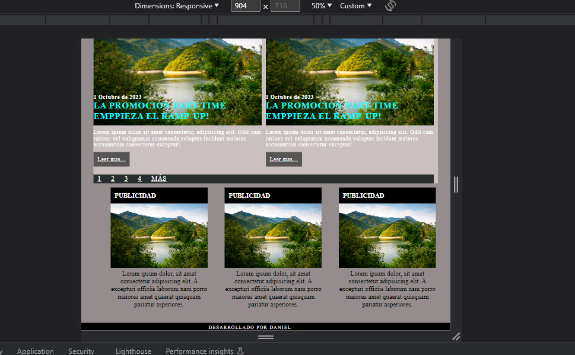
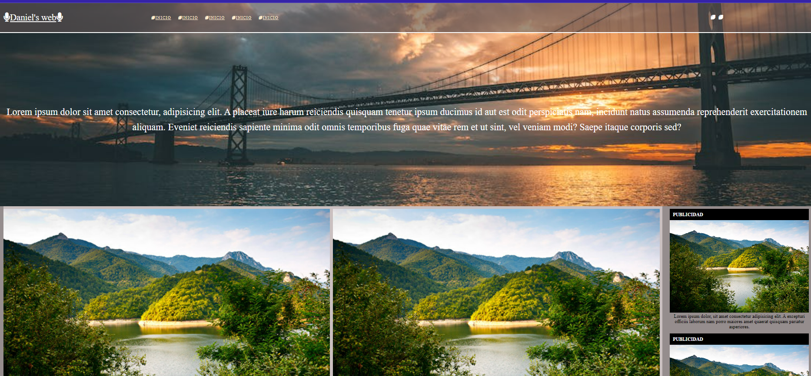

# RAMP-UP Project with HTML5 and CSS3 - By Daniel Miguelez Poblador. 💯

<h3 align="center">FIRST PROJECT MIXING HTML5 AND CSS3</h3>

<p align="center">In this project, I have developed a webpage based on flat code, and being linked afterwards with another document, this time with CSS so I could give it a bit more of life to it, to be able to see different components used and organized in different ways. </p>

## Goals of this project🤑

To learn how to use and combine both HTML and CSS while we put and practice different tags learned in the previous lessons, linking both documents is also important and another important thing, to know how CSS3 affects every HTML tag, through different classes being used in the meantime.

### DIFFERENT TECHNOLOGIES USED IN THE PROJECT 👻

This project has been created using HTML, CSS with FLEXBOX.

<objectives>
  <ol>
    <li>HTML5 TAGS</li>
    <li>ID'S AND CLASS</a></li>
    <li>PROPERTIES ADDED TO THE PREVIOUS CLASSES</a></li>
    <li>FLEXBOX</a></li>
    <li>MEDIA QUERIES</a></li>
  </ol>
</objectives>

### Built With

[](https://shields.io/)


## Getting Started 🥳

In here you can appreciate an example of how you may give instructions on setting up your project locally.
To get a local copy up and running follow these simple example steps.

### Installation 🙊

1. Clone the repo
    ```sh
    git clone https://github.com/DanielMiguelez/Practica-Web-Alumnos
    ```
2. Then is easy to use, easy to tell how it works.

## License

This project is under license of Daniel Miguélez and the students of The bridge.

## Project's review and GIFS

Here we can see with our gifs, how we did it, and how do they work.





## Contact 


<p align="center" >You can ask me anything here</p>
<p align="center" >Daniel Miguelez</p>
</br>
<p align="center">
<a href = "mailto:danielmiguelez1993@gmail.com"></a>
    <a href="https://www.linkedin.com/in/daniel-miguelez-poblador/" target="_blank"></a> 
</p>